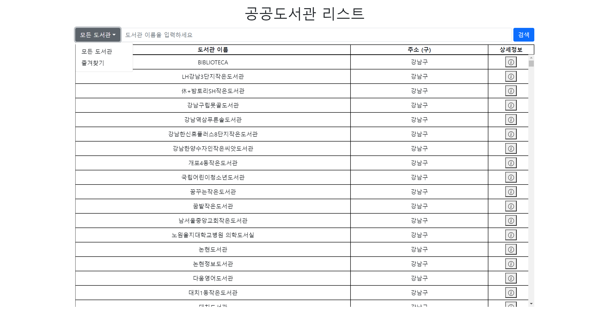
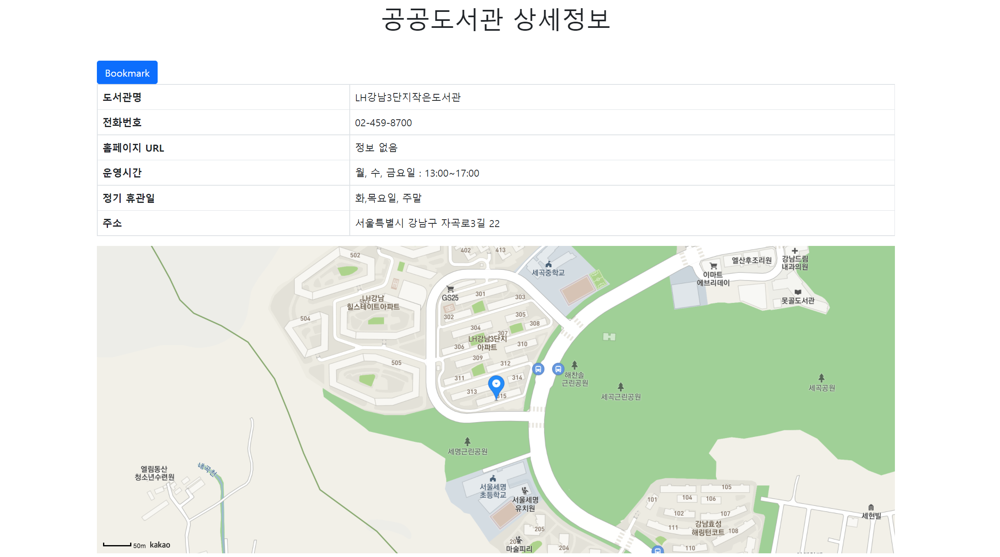

# 서울시 도서관 위치 정보 사이트 v2.0.0

## 설명

서울시에 존재하는 모든 도서관 정보 및 위치를 확인할 수 있는 사이트입니다.

## 설치방법

`git clone https://github.com/OS-team18/final_project.git`  
 `git clone git@github.com:OS-team18/final_project.git`

local repository에서 html파일을 열 경우, json파일을 읽어오지 않습니다. Visual Studio Code에서 'Live Server'를 이용하거나 '사용방법'에 존재하는 사이트로 들어가서 사용하세요.  
 'Kakao 지도 Web API'를 사용하였기 때문에 따로 사이트를 만들 경우 api key를 발급받아야 합니다. 자세한 내용은 'API'부분을 참고하세요.

## 사용방법

[서울시 도서관 위치 정보 사이트](https://os-team18.github.io/final_project/)

1. 사이트 사용 방법을 보여줍니다.
   
2. <strong>지도에서 도서관 찾기</strong>의 'Go'를 클릭하면 지도에 모든 도서관의 위치가 표시됩니다.
   
3. 위치 마크를 클릭한 후 도서관 이름이 나오며 도서관 이름을 클릭하면 도서관 정보를 볼 수 있습니다.
   
4. 메인 페이지에서 <strong>리스트에서 도서관 찾기</strong>의 'Go'를 클릭하면 간단한 도서관 정보를 볼 수 있습니다.  
   검색 필터를 통해 '모든 도서관/즐겨찾기'를 선택할 수 있습니다.
   
5. 사용자가 상세정보 버튼을 클릭하면 더 많은 정보 (전화번호, 도서관 웹사이트, 운영시간 등)을 볼 수 있습니다.  
   왼쪽 위의 'Bookmark'를 통해 즐겨찾기에 추가할 수 있습니다. 해당 버튼을 클릭하면 'Already Bookmarked'로 바뀌며 해당 버튼을 클릭시 즐겨찾기에서 사라집니다.
   
6. '공공도서관 리스트' 사이트에서 '즐겨찾기'를 선택한다면 상세정보에서 'Bookmark'를 에 저장한 도서관들이 나열됩니다.
   
7. 홈페이지 주소를 클릭하면 해당 도서관의 홈페이지로 이동합니다.
   

# 사용 영상

## 버전

v1.0.0 - 도서관 정보 (이름 및 주소 (구))표로 표시 및 상세 정보 버튼 클릭시 도서관 상세정보 및 위치 지도에 표시  
v2.0.0 - 메인 페이지 변경, 지도에서 도서관 찾기 기능 추가.  
v2.1.0 - 검색 필터 기능 추가, 북마크 기능 추가.  
v2.2.0 - 이용 가능 시간 필터 추가 예정

## API

카카오 개발자에서 제공하는 'Kakao 지도 Web API'를 사용하였습니다.  
 [Kakao 지도 Web API](https://apis.map.kakao.com/web/guide/)  
 해당 사이트에서 카카오 계정을 이용하여 api key를 발급받을 수 있습니다.  
 자세한 내용은 해당 웹사이트에서 확인할 수 있습니다.
